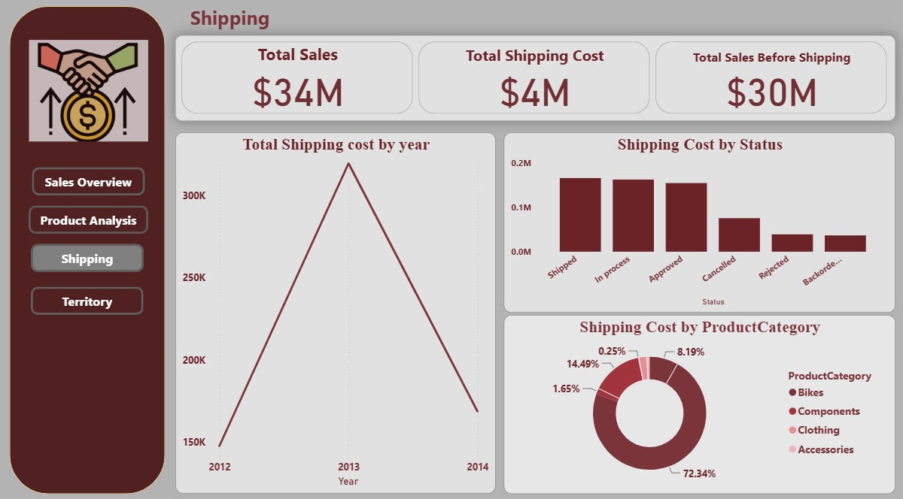
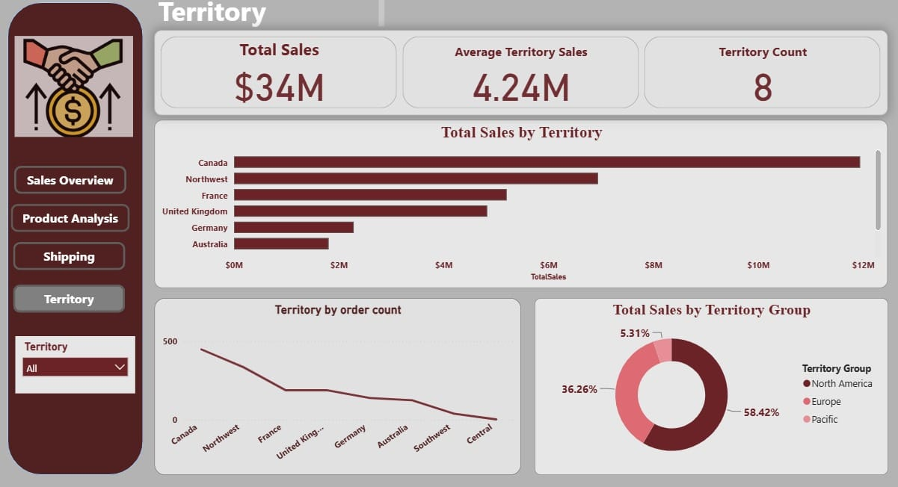

# Sales-Analysis
# 📊 Sales Analysis Dashboard

## 👩‍💻 About the Project

This project focuses on analyzing sales data using Microsoft Excel to understand overall sales performance, product performance, shipping costs, and geographical sales distribution.

The project is divided into four connected dashboard sections:

- **Sales Overview**
- **Product Analysis**
- **Shipping Analysis**
- **Territory Analysis**

Each dashboard provides a different perspective of the same sales data, while together they provide a complete overview of the company's sales performance.

---

# 1️⃣ Sales Overview

## 🔍 Dashboard Explanation

The Sales Overview dashboard provides a high-level summary of the company's overall sales performance.

It analyzes total sales, total shipping costs, number of customers, total orders, number of employees, sales trends over time, product categories, and order status.

## 📌 Key Insights

- *Total Sales:* The company generated approximately **$34M** in total sales.

- *Total Shipping Cost:* Total shipping costs are approximately **$4M**.

- *Total Customers:* The dataset contains **294 customers**.

- *Total Orders:* The dashboard contains approximately **1K orders**.

- *Total Employees:* The dataset includes **10 employees**.

- *Sales by Year:* Sales increased significantly over time, with some of the highest values reaching approximately **$2.10M**.

- *Sales by Product Category:* **Bikes** are the highest-performing category, followed by Components, Clothing, and Accessories.

- *Sales by Status:* The dashboard compares sales across different order statuses, including Approved, In Process, Shipped, Cancelled, Rejected, and Backordered.

---

# 2️⃣ Product Analysis

## 🔍 Dashboard Explanation

The Product Analysis dashboard focuses on understanding product performance and identifying which products and product categories contribute the most to total sales.

It analyzes total orders, total quantity, total products, the Top 5 Products by sales, sales by product category, and the Top 3 Product Subcategories.

## 📌 Key Insights

- *Total Orders:* The dashboard shows approximately **1K total orders**.

- *Total Quantity:* The total quantity sold is approximately **86K**.

- *Total Products:* The dataset contains **250 products**.

- *Top Products:* The highest-selling products are mainly from the **Mountain Bike** and **Touring Bike** product lines.

- *Sales by Product Category:* **Bikes** dominate total sales, representing approximately **80.54%** of total sales.

- *Components:* Components contribute approximately **16.14%** of total sales.

- *Clothing:* Clothing contributes approximately **2.46%**.

- *Accessories:* Accessories represent the smallest share of total sales.

- *Top Product Subcategories:* The top three subcategories shown are **Road Bikes, Mountain Bikes, and Touring Bikes**.

---

# 3️⃣ Shipping Analysis

## 🔍 Dashboard Explanation

The Shipping Analysis dashboard focuses on understanding the company's shipping performance and shipping expenses.

It analyzes total sales, total shipping costs, sales before shipping, shipping costs by year, shipping costs by order status, and shipping costs by product category.

## 📌 Key Insights

- *Total Sales:* Total sales reach approximately **$34M**.

- *Total Shipping Cost:* The company has approximately **$4M** in total shipping costs.

- *Total Sales Before Shipping:* Sales before shipping costs are approximately **$30M**.

- *Shipping Cost by Year:* Shipping costs changed significantly during the analyzed period, reaching the highest level in **2013**, at approximately **$320K**.

- *2012 Shipping Cost:* Shipping costs in 2012 were approximately **$150K**.

- *2014 Shipping Cost:* Shipping costs decreased after the 2013 peak to approximately **$170K** in 2014.

- *Shipping Cost by Status:* The highest shipping costs are associated with **Shipped, In Process, and Approved** orders.

- *Shipping by Product Category:* **Bikes** account for the largest share of shipping costs at approximately **72.34%**.

- *Components:* Components represent approximately **8.19%** of shipping costs.

- *Clothing:* Clothing contributes approximately **14.49%**.

- *Accessories:* Accessories account for a relatively small percentage of shipping costs.

---

# 4️⃣ Territory Analysis

## 🔍 Dashboard Explanation

The Territory Analysis dashboard focuses on analyzing sales performance across different geographical territories.

It provides an overview of total sales, average territory sales, territory count, sales by territory, order count by territory, and sales by territory group.

## 📌 Key Insights

- *Total Sales:* Total sales across all territories reach approximately **$34M**.

- *Average Territory Sales:* The average sales per territory are approximately **$4.24M**.

- *Territory Count:* The dashboard contains **8 territories**.

- *Sales by Territory:* **Canada** generates the highest total sales among the territories shown, followed by **Northwest, France, and the United Kingdom**.

- *Canada:* Canada is the strongest territory in terms of total sales, reaching approximately **$12M**.

- *Northwest:* Northwest is the second-highest territory with sales of approximately **$7M**.

- *Territory by Order Count:* Canada also has the highest order count, followed by Northwest and France.

- *Territory Groups:* **North America** contributes the largest share of sales at approximately **58.42%**.

- *Europe:* Europe contributes approximately **36.26%** of total sales.

- *Pacific:* The Pacific territory group contributes approximately **5.31%**.

---

# 🛠️ Tools Used

- Microsoft Excel
- Data Cleaning
- Pivot Tables
- Charts
- Data Analysis
- Data Visualization
- Dashboard Design

# 📚 What I Learned

Through this project, I practiced analyzing sales data from different perspectives using Microsoft Excel.

I learned how to create interactive dashboards, build KPIs, use Pivot Tables, analyze sales trends, compare product categories, evaluate shipping costs, and understand geographical sales performance.

I also improved my ability to transform raw data into meaningful visualizations and communicate business insights clearly.

# 🎯 Project Summary

This project combines four connected dashboards into one complete **Sales Analysis Dashboard**.

The **Sales Overview** provides the overall business performance, while **Product Analysis** focuses on product performance, **Shipping Analysis** evaluates shipping costs, and **Territory Analysis** examines geographical sales performance.

Together, these four dashboards provide a comprehensive view of the company's sales activities and help support better data-driven business decisions.
